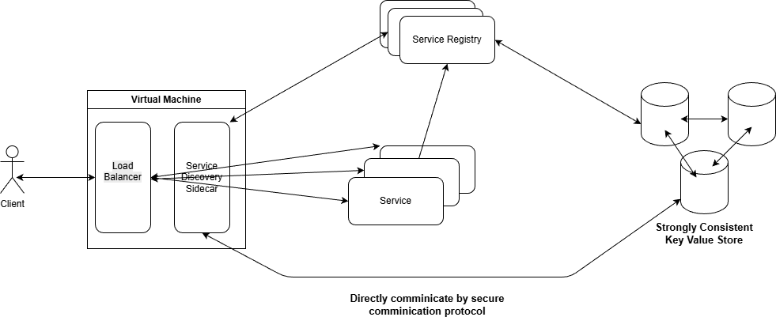

# Java Service Discovery

## Purpose of Project

The purpose of this project is to build a general-purpose, server-side service discovery mechanism for Java-based distributed systems. Services register themselves, send periodic heartbeats, and the system automatically notifies external load balancers when instances go up or down.

## Architecture

- **etcd** is used as the service registry (horizontally scalable key-value store)
- **Nginx** acts as the external load balancer, updated dynamically via sidecar
- **Docker / Docker Compose** is used for containerisation and local orchestration

### High Level Architecture



## Functional Requirements

| Requirement | Description |
|---|---|
| Service Registration | A service can register itself to the registry with its metadata |
| Heartbeat | Registered services send a heartbeat every 5 seconds to signal liveness |
| Live Update | When a service is added or removed, the load balancer is notified automatically |
| Service Discovery | The load balancer sidecar can query the current list of healthy service instances |

## Non-Functional Requirements

- Registry backed by etcd, which scales horizontally
- Service TTL is 10 seconds — if a heartbeat is missed, the instance is considered dead and the load balancer is updated
- Low GC latency (off-heap and allocation-conscious design where applicable)

## Use Cases

### Register Service

| Field | Detail |
|---|---|
| **System** | Registry Service |
| **Actors** | Any Service, Strong Consistent KV Database |
| **Trigger** | Service starts up and sends a registration request to the Service Registry |
| **Pre-conditions** | Service Registry is running; the registering service knows the Registry address; the service has a pre-assigned unique ID |
| **Post-condition** | Registration record is durably written to the database |

**Main Flow**
1. Service sends a registration request to the Service Registry.
2. System validates the incoming request.
3. System writes the record to the database.
4. System responds with a success message.

**Alternative Flow**
- If the service is already registered, the system overwrites the existing record and continues the main flow.

---

### Deregister Service

| Field | Detail |
|---|---|
| **System** | Service Registry |
| **Actors** | Any Service, Strong Consistent KV Database |
| **Trigger** | Service wants to remove itself from the registry (e.g. graceful shutdown) |
| **Pre-conditions** | Service Registry is running; the service knows the Registry address; the service is already registered |
| **Post-condition** | Record is cleanly removed from the database |

**Main Flow**
1. Service sends a deregistration request to the Service Registry.
2. System validates the incoming request.
3. System removes the record from the database.
4. System responds with a success message.

**Alternative Flow**
- If the service is already deregistered, the system takes no action.

---

### Send Heartbeat

| Field | Detail |
|---|---|
| **System** | Service Registry |
| **Actors** | Any Service, Strong Consistent KV Database |
| **Trigger** | Service periodically sends a heartbeat when its scheduled interval fires (every 5 seconds) |
| **Pre-conditions** | Service Registry is running; the service knows the Registry address; the service is already registered |
| **Post-condition** | Heartbeat is durably recorded in the database, renewing the service TTL |

**Main Flow**
1. Service sends a heartbeat message to signal it is alive.
2. System processes the incoming message.
3. System updates the TTL record in the database.

---

### Get Service List

| Field | Detail |
|---|---|
| **System** | Service Registry |
| **Actors** | Load Balancer Sidecar, Strong Consistent KV Database |
| **Trigger** | Sidecar starts up and initialises its upstream configuration |
| **Pre-conditions** | Service Registry is running; Sidecar knows the Registry address and which service name to watch |
| **Post-condition** | Service list is successfully fetched from the database and returned to the Sidecar |

**Main Flow**
1. Sidecar sends a request asking for the current list of service instances.
2. System validates the incoming request.
3. System queries the database for matching records.
4. System responds with the service list.

**Alternative Flow**
- If no matching records exist, the system returns an empty response and takes no further action.

---

## Installation

Clone the repository:

```bash
git clone https://github.com/jenkem1337/service-discovery.git
```

Start all services:

```bash
cd service-registry-example
docker compose -f example-app-compose.yaml up --build
```
